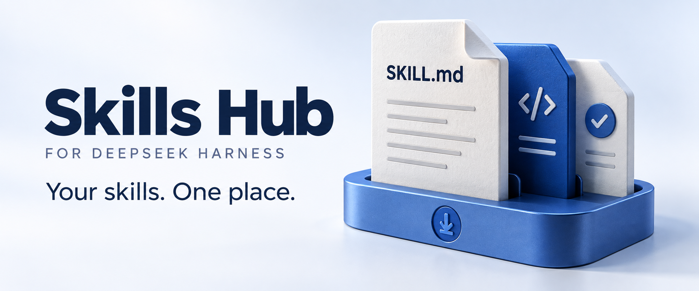
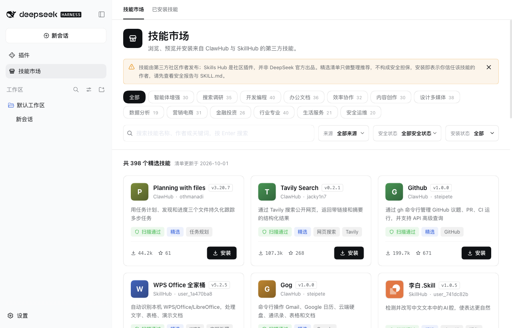

<p align="right">
  <a href="./README.md">简体中文</a> · <strong>English</strong>
</p>

<p align="center">
  
</p>

<p align="center">
  <strong>A skill marketplace and local skill manager for DeepSeek Harness</strong><br>
  Browse ClawHub and SkillHub to find the skills you need.
</p>

<p align="center">
  <a href="#quick-start">Quick start</a> · <a href="./docs/COMPATIBILITY.md">Compatibility</a> · <a href="./LICENSE">MIT</a>
</p>

## Discover, install and manage skills in Harness

Search ClawHub and SkillHub, read a skill’s instructions, and install it into Harness. Manage marketplace installations and existing local skills together in **Installed**.

<p align="center">
  
</p>

| Feature | What it does |
| --- | --- |
| **Discover skills** | Search and filter ClawHub and SkillHub together, with more results as you scroll. |
| **Preview before installing** | Read instructions, inspect files and check security reports from the source. |
| **Manage installed skills** | Search local skills, inspect their source and installation path, and confirm removal. |

## Quick start

Supports **DeepSeek Harness 0.2.0-rc.2**. [Compatible versions](./docs/COMPATIBILITY.md)

Open **DeepSeek Harness desktop → Plugins → Add plugin** and paste either of the following:

**GitHub repository URL (recommended)**

```text
https://github.com/NanmiCoder/dsh-skills-hub
```

**Or the npm package name**

```text
@nanmicoder/dsh-skills-hub
```

Click **Install → Enable now**, then open **Skills Hub** from the sidebar.

## Use

1. **Find**: enter a keyword or filter by source and security status.
2. **Preview**: open a skill to read its instructions and inspect its files.
3. **Install and manage**: confirm installation, then find or remove it in **Installed**.

Skills come from third-party authors. Check the source and instructions before installing; security reports are provided for reference.

## Installed skills

Use **Installed** to view and remove marketplace installations and existing local user skills. Project-specific skills and skills bundled with Harness are not included.

The removal dialog shows the exact location for you to confirm. To remove Skills Hub itself, open **@nanmicoder/dsh-skills-hub** on the desktop **Plugins** page and click **Uninstall**. Your installed skills will remain.

[Report an issue](https://github.com/NanmiCoder/dsh-skills-hub/issues) · [Advanced configuration](./docs/CONFIGURATION.md) · [Contribute](./CONTRIBUTING.md) · [MIT license](./LICENSE)
